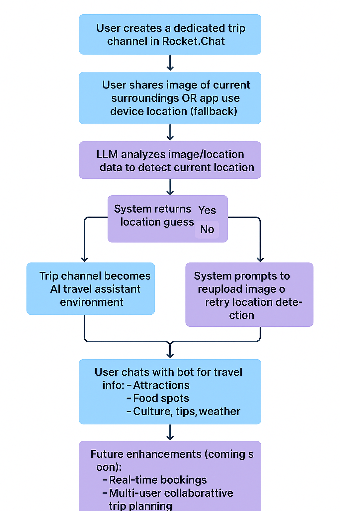

# Trip Helper App for Rocket.Chat 🚀 - GSoC 2025 Final Report

## Introduction

Hi! I'm **Piyush Bhatt**, and I had the incredible opportunity to contribute to Rocket.Chat during Google Summer of Code 2025.

During my GSoC period, I worked on the Trip Helper App, an intelligent travel companion integrated with Rocket.Chat that leverages LLM technology to provide comprehensive trip assistance. This innovative app serves as your personal travel guide, offering valuable insights, recommendations, and information to enhance your travel experience through the power of AI and seamless chat integration.


## What's Rocket.Chat?

Rocket.Chat is an open-source business chat tool. It's a software that allows companies and organizations to communicate on their own platform.

In this project, I worked on developing new features that can be utilized on the Rocket.Chat platform.

## Project Overview

The goal of this project was to develop an intelligent Trip Helper App that could be seamlessly integrated with Rocket.Chat to serve as a comprehensive travel companion. In Trip Helper 2025, my focus was on leveraging LLM technology to create an interactive chat-based assistant that provides personalized travel recommendations, destination insights, and trip planning assistance. The project sought to enhance the travel experience by offering real-time information about attractions, local customs, weather updates, and practical travel tips through an intuitive conversational interface. I also worked on integrating the app with Rocket.Chat's ecosystem, ensuring smooth communication flows and developing features that make trip planning collaborative and accessible to users within their familiar chat environment.

## Project Goals 🏁

The main objective of my project was to create an AI-powered trip assistance app that seamlessly integrates with Rocket.Chat. Specifically, I aimed to:

- Implement an intelligent conversation system capable of providing personalized travel recommendations and destination insights.

- Develop a chat-based interface allowing users to easily interact with the trip helper directly within Rocket.Chat.

- Integrate open-source LLMs (such as Llama) to power the travel assistance and recommendation engine.

- Ensure the generated travel information is accurate, relevant, and formatted appropriately for immediate use in trip planning.

- Create a comprehensive knowledge base covering attractions, local customs, weather patterns, and practical travel tips.

- Build a foundation for future developments, including real-time booking integration and collaborative trip planning features.

These goals were designed to address the challenge of making travel planning more accessible and informed for Rocket.Chat user communities.

## How This Application Works

The system works as follows. Steps 6 and 7 are planned for future development:



_Figure: Trip Helper App Workflow Diagram_

1. The user creates a dedicated trip channel to access all Trip Helper functionality within Rocket.Chat.

2. The user shares an image of their current surroundings from their trip location, or alternatively, the app can use device location services if image sharing is not possible.

3. The LLM analyzes the provided image or location data to detect and identify the user's current location.

4. The system provides the detected location information and prompts the user with a "Yes" or "No" confirmation to verify if the location detection is accurate.

5. Once the user confirms the location, the trip channel transforms into a specialized environment where they can interact with the AI travel assistant.

6. The user can now chat with the bot and ask any questions about their trip, including local attractions, dining recommendations, cultural insights, weather updates, and travel tips.

7. Future enhancements will include real-time booking integration and collaborative trip planning features for multiple users.

## Why I Chose This Project

Honestly, I've always been that person who spends way too much time researching before any trip. You know, scrolling through countless travel blogs, asking friends for recommendations, and still feeling like I'm missing out on the best spots locals actually go to.

When I saw this project opportunity with Rocket.Chat, it just clicked for me. I thought - what if there was a way to have all that travel knowledge at your fingertips, right in your chat? No more switching between 10 different apps to plan a trip or figure out what to do next.

The tech side really excited me too. Working with LLMs and integrating them into something people actually use daily? That's the kind of challenge I live for. Plus, Rocket.Chat's platform seemed like the perfect playground to build something that could genuinely help travelers.

I guess you could say I wanted to solve my own problem - and hopefully help other travelers along the way!

## Project Links 🔗

- [GitHub Repository](https://github.com/RocketChat/Apps.Trip.Helper)
- [GSoC Project Details](https://summerofcode.withgoogle.com/programs/2025/projects/Ffe2Bu26)

## Implementation Details and Demonstration

### Prompt Engineering

The prompt engineering for the Trip Helper App is structured around three core functionalities, each requiring specialized prompts to ensure accurate and user-friendly responses. This multi-layered approach allows the system to handle different types of user interactions seamlessly.

**Key Features:** The prompts utilize structured completion approaches, context-aware instructions, and conversational tone guidelines to deliver consistent, helpful travel assistance.

#### 1. Image Detection and Validation System

I've developed a two-stage prompt system for handling image-based location detection:

**First Prompt - Image Validation:** This prompt validates whether the uploaded image contains recognizable location markers, landmarks, or geographical features that can be used for location identification. It ensures the system only processes images that have sufficient contextual information for accurate location detection.

**Second Prompt - Image Recognition:** Once validated, this specialized prompt analyzes the image content to identify specific landmarks, architectural features, natural formations, or cultural elements that indicate the user's location. It's designed to provide detailed location information including city, country, and notable nearby attractions.

#### 2. JSON to Human-Friendly Text Conversion

I've crafted prompts specifically for transforming structured JSON data about local events, attractions, and activities into engaging, conversational text. This ensures that when the system retrieves information about events occurring in the user's area, it presents the data in a natural, easy-to-read format rather than raw technical output.

The prompt structure focuses on:

- Converting technical data into descriptive, engaging language
- Maintaining accuracy while improving readability
- Including relevant details like timing, location, and cultural context
- Formatting information in a chat-friendly manner

#### 3. Conversational Query Response System

For handling direct user queries within the trip channel, I've developed comprehensive prompts that ensure the AI responds appropriately to any travel-related question. These prompts are designed to:

- Understand context from previous conversations in the channel
- Provide accurate, location-specific information
- Maintain a helpful, friendly tone consistent with a travel companion
- Offer practical advice and suggestions based on the user's confirmed location

#### Structured Completion Approach

In crafting these prompts, I opted for a structured completion approach across all three systems. Each prompt is carefully organized with clearly defined instructions for input processing, context understanding, and output formatting.

I chose the structured completion approach for several reasons:

**Precise Content Control:** This method allows for more accurate control over the generated travel advice. By providing clear structure and specific instructions for each type of interaction, we ensure that the AI model produces consistent, helpful responses that meet travelers' exact needs.

**Consistency:** The structured approach helps maintain consistency across different types of user interactions, ensuring that whether someone uploads an image, asks a direct question, or requests event information, they receive responses in a similar helpful format.

**Context Awareness:** This approach makes it easier to maintain context throughout the conversation, allowing the system to remember the user's location and previous interactions to provide more personalized assistance.

The structured completion approach has proven effective in my testing, resulting in accurate location detection, engaging event descriptions, and helpful conversational responses that consistently meet the quality standards expected from a travel companion.

### Style Instructions and Output Formatting

The prompt design includes specific styling instructions to ensure consistent, user-friendly outputs across different functionalities. Each prompt type has tailored formatting requirements that enhance readability and user experience.

#### Image Analysis Prompts Styling

For the validation and confirmation prompts (`VALIDATION_PROMPT` and `CONFIRMATION_PROMPT`), I implemented strict JSON-only output formatting:

```json
"style_instructions": {
  "validation_response": "Respond only with parseable JSON: { \"isLandmark\": \"true\" } or { \"isLandmark\": \"false\" }",
  "confirmation_response": "Respond only with parseable JSON: { \"name\": \"Location Name, City, Country\" } or { \"name\": \"unknown\" }"
}
```

This ensures that the system receives clean, parseable data that can be immediately processed without additional text parsing. The prompts explicitly state: _"Do not provide any text, explanation, or code formatting around the JSON object."_

#### Event Information Styling

For the `INFORMATION_PROMPT`, I designed a comprehensive styling system that transforms raw JSON data into engaging, markdown-formatted content:

```json
"style_instructions": {
  "persona": "Act as an enthusiastic local guide with warm, encouraging tone using emojis",
  "categorization": "Group events into logical categories (🎵 Music, 🏏 Sports, 🎨 Arts)",
  "formatting": "Use Level 3 headers (###), bullet points (*), and clickable markdown links",
  "content_approach": "Summarize in your own words, don't just copy the source content"
}
```

#### Event Data Extraction Styling

For date and time extraction prompts (`EVENTS_DATES_PROMPT`, `EVENTS_REMINDER_PROMPT`), I implemented structured JSON array formatting:

```json
"style_instructions": {
  "output_format": "Clean JSON array with title, date (YYYY-MM-DD), and time fields",
  "data_precision": "Extract only future events, ignore past dates",
  "time_handling": "Convert to 24-hour format, default to 12:00 if unspecified"
}
```

#### Style Selection Impact

This style selection creates distinct differences in how information is presented. For example:

**For structured JSON responses (Image Analysis):**

```json
{ "isLandmark": "true" }
{ "name": "India Gate, New Delhi, India" }
```

**For conversational event information:**

```markdown
### 🎵 Music & Concerts

- **Secret Concert** - Enjoy a mysterious candlelit performance at 6:30 PM on Monday at Via Bologna. [Source](link)

### 🎨 Arts & Culture

- **Art Exhibition Opening** - Discover local artists' latest works this weekend at the downtown gallery. [Source](link)
```

#### Few-Shot Learning Implementation

To improve output quality and consistency, I incorporated contextual examples within the prompts. For the information prompt, I included guidelines for:

- **Tone consistency**: Using phrases like "I found some exciting events" and emoji usage
- **Structure patterns**: Category headers, bullet formatting, and source linking
- **Content transformation**: Converting technical data into engaging descriptions

The prompts use real-world examples to guide the AI in generating responses that match the desired travel companion persona while maintaining technical accuracy and proper formatting.

### LLM Selection and Model Performance

In my experiments, I found that the Llama 3.2 Vision 11B models (including both Turbo and Instruct variants) perform exceptionally well with our multi-modal travel assistance approach. I also tested the integration capabilities across different deployment scenarios to ensure optimal performance.

Key observations:

**Unified Vision and Chat Capabilities:** The Llama 3.2 Vision models excel at both visual analysis and conversational interactions within a single model architecture. This eliminates the need for separate models for image recognition and text generation, streamlining the entire system while maintaining high accuracy across both modalities.

**Open Source Alignment:** Since we're developing an open-source project for the Rocket.Chat ecosystem, it was crucial to use open-source models. The Meta-Llama 3.2/3.3 model family provides complete transparency and accessibility, allowing the community to reproduce, modify, and improve upon our work without licensing restrictions.

**Fast Image Recognition:** The Vision 11B models demonstrate remarkable speed in image processing and landmark identification. During testing, the models consistently provided accurate location detection within seconds, making the user experience smooth and responsive for real-time travel assistance.

**Performance Consistency:** Despite the complexity of handling both visual and textual inputs, our structured prompt approach maintained consistent performance across different use cases - from landmark identification to event information formatting.

These findings highlight the effectiveness of choosing Llama 3.2 Vision models for our Trip Helper App, crucial for delivering a reliable, open-source travel companion that can handle the diverse requirements of modern travelers while maintaining the collaborative spirit of the Rocket.Chat ecosystem.

### Slash Commands

I developed a comprehensive set of slash commands to integrate the Trip Helper App seamlessly with Rocket.Chat, providing users with intuitive access to all travel assistance features:

- `/trip help` - Returns a complete list of available commands and their usage instructions
- `/trip create` - Creates a dedicated trip channel for accessing all app functionality
- `/trip reminder` - Sets up reminders for upcoming events and activities in your area
- `/trip location` - Shares or updates your current location within the trip channel
- `/trip info` - Retrieves information about events happening around your current location

#### Command Details and Functionality

**Create Command (`/trip create`):** This command initializes a new dedicated trip channel where users can interact with all the app's functionality. The channel becomes a specialized environment optimized for travel assistance, complete with location context and personalized recommendations. Once created, the channel serves as your personal travel hub where the AI assistant maintains context about your trip and preferences.

**Reminder Command (`/trip reminder`):** This feature helps users set up intelligent reminders for upcoming events discovered through the location-based search. When events are identified in your area, the system can automatically schedule reminders with all relevant details pre-populated, including event names, dates, times, and locations. Users can customize reminder timing and receive notifications directly within Rocket.Chat.

**Location Command (`/trip location`):** This command allows users to manually set or update their current location within the trip channel. It's particularly useful when automatic location detection isn't available or when planning for future destinations. The command accepts various input formats and updates the context for all subsequent travel recommendations and event searches.

**Info Command (`/trip info`):** This powerful command retrieves comprehensive information about events, attractions, and activities happening around your current location. The response includes categorized events with detailed descriptions, timing information, and direct links to sources. Each event listing comes with an integrated reminder button that has all the event data pre-configured, making it easy to set up notifications with a single click.

Here's an example of how the info command works in practice:

```
/trip info
```

The system responds with formatted event information like:

```markdown
### 🎵 Music & Concerts

- **Jazz Night at Blue Note** - Live jazz performance every Thursday at 8:00 PM
  [Source](link)

### 🎨 Arts & Culture

- **Modern Art Exhibition** - Contemporary local artists showcase, open until Sunday
  [Source](link)

  [⏰ Set Reminder Buttons]
```

Each reminder button contains pre-populated data including the event title, date, time, and location, streamlining the user experience and making trip planning effortless within the familiar Rocket.Chat interface.

## Code Contributions 💻

### Merged Pull Requests

- **[#1 - Initialize Slash Command Setup](https://github.com/RocketChat/Apps.Trip.Helper/pull/1):** Set up the foundational slash command structure for the Trip Helper App. Implemented the `/trip` command framework and created the help command functionality to guide users through available features.

- **[#2 - Add Issue and PR Templates](https://github.com/RocketChat/Apps.Trip.Helper/pull/2):** Enhanced project collaboration by implementing standardized issue and pull request templates, making it easier for new contributors to participate in the project development process.

- **[#3 - Implement Automatic Direct Room Creation](https://github.com/RocketChat/Apps.Trip.Helper/pull/3):** Developed automatic room creation functionality that triggers upon app installation, complete with welcome messages explaining the app's capabilities and enabling immediate image upload functionality for location detection.

- **[#4 - Add LLM Configuration Settings](https://github.com/RocketChat/Apps.Trip.Helper/pull/4):** Implemented user-configurable LLM model settings including API key management and model selection options. Added the `/trip config` command with modal interface for easy credential management and configuration updates.

- **[#5 - Integrate LLM Model with Basic Prompts](https://github.com/RocketChat/Apps.Trip.Helper/pull/5):** Established core LLM integration with initial prompt engineering for image recognition. Implemented the `/trip create` command and foundational conversational room features, enabling basic image analysis and location detection capabilities.

- **[#6 - Fix Room Interaction Issues](https://github.com/RocketChat/Apps.Trip.Helper/pull/6):** Resolved critical bug where newly created rooms weren't responding to user interactions due to improper room name storage from PR #5, ensuring seamless user experience across all created trip channels.

- **[#7 - Implement Location-Based Conversations](https://github.com/RocketChat/Apps.Trip.Helper/pull/7):** Enhanced conversational capabilities by implementing location storage per room and enabling context-aware responses. Improved prompt engineering for better location-specific assistance and user query handling.

- **[#8 - Add Google Search API Integration](https://github.com/RocketChat/Apps.Trip.Helper/pull/8):** Integrated Google Search API to power the `/trip info` command, enabling location-specific searches and providing comprehensive local information including events, attractions, and activities.

- **[#9 - Implement Reminder Functionality](https://github.com/RocketChat/Apps.Trip.Helper/pull/9):** Added comprehensive reminder system with intelligent time validation (preventing past dates, handling next-day logic for times within 12 hours). Enhanced info command responses with LLM-powered formatting and integrated quick-access reminder buttons for discovered events.

### Work in Progress

- **[#10 - Multi-Language Translation Support](https://github.com/RocketChat/Apps.Trip.Helper/pull/10):** Currently developing internationalization features to support app responses in German, English, Polish, Portuguese, and Russian, making the Trip Helper accessible to a global user base.

### Future Improvements and Expansion Possibilities

**Enhanced Image Recognition:** Improve landmark detection accuracy and expand the database of recognizable locations to include more regional and cultural landmarks worldwide.

**Real-Time Booking Integration:** Implement direct booking capabilities for discovered events and attractions, allowing users to seamlessly transition from discovery to reservation within the chat interface.

**Collaborative Trip Planning:** Extend functionality to support multiple users planning trips together, including shared itineraries, group polls for activity selection, and synchronized location sharing.

**Advanced Reminder System:** Develop smart reminder features including weather-based suggestions, crowd level alerts, and personalized recommendations based on user preferences and past activities.

**API Expansion:** Integrate additional travel APIs for flights, accommodations, and transportation to provide comprehensive trip planning capabilities beyond local event discovery.

## Challenges Faced and Lessons Learned 🎓

### Prompt Engineering and LLM Integration

Prompt Engineering was the area where I invested most of my effort during the GSoC period. Creating effective prompts for the Trip Helper App proved to be one of the most challenging yet rewarding aspects of the project.

The biggest challenge I faced was in crafting working prompts that would produce consistent and expected responses. Initially, the LLM outputs were completely unexpected - sometimes the image recognition would fail to identify obvious landmarks, other times the event information would be formatted incorrectly or miss crucial details. It was a frustrating period where I had to iterate through dozens of prompt variations to understand how to communicate effectively with the AI models.

Through extensive experimentation with different prompt structures, I learned that the key to successful prompt engineering lies in being extremely specific about expected outputs, providing clear examples, and structuring prompts with precise instructions for each use case. The two-stage validation approach for image recognition and the structured JSON formatting requirements emerged from these trial-and-error experiences.

### Feature Development and Architectural Decisions

Adding some features required completely logical thinking and significant time investment to explore different possible approaches before choosing the most convenient implementation method.

The reminder functionality, for instance, presented multiple architectural challenges. I had to consider various approaches: should reminders be stored per user or per room? How should time validation work across different time zones? What's the best way to handle "next day" logic when users set times within 12 hours of the current time? Each decision required careful analysis of user experience implications and technical feasibility.

Similarly, the location-based conversation system required thoughtful consideration of data persistence, context management, and room-specific storage. I experimented with different approaches before settling on the current room-based location storage that maintains context while ensuring privacy and separation between different trip channels.

### Key Achievements:

- Implemented a comprehensive prompt engineering system for multi-modal travel assistance using advanced Llama 3.2 Vision models.
- Developed an intuitive slash command interface that seamlessly integrates with Rocket.Chat's ecosystem.
- Created an intelligent image recognition system for landmark identification and location detection.
- Built a sophisticated reminder system with smart time validation and user-friendly interfaces.
- Integrated Google Search API for location-specific event discovery and travel recommendations.
- Established the foundation for future AI-powered travel features and collaborative trip planning.

Looking ahead, I'm excited about the potential impact of the Trip Helper App on the Rocket.Chat community and travelers worldwide. The app represents a new paradigm in travel assistance - one that combines the power of AI with the collaborative nature of chat platforms.

I'm deeply grateful to my mentors, the Rocket.Chat team, and the GSoC program for this life-changing opportunity. This experience has not only enhanced my technical skills but also deepened my appreciation for open-source collaboration and AI applications in real-world scenarios.

The journey from initial concept to working application has taught me invaluable lessons about prompt engineering, user experience design, and the iterative nature of software development. I look forward to continuing my contributions to Rocket.Chat and applying these learnings to future projects that bridge the gap between AI technology and human needs.

### Key Lessons Learned

**Iterative Development is Essential:** The most effective features emerged through multiple iterations rather than trying to perfect them from the start. Each version taught me something new about user needs and technical constraints.

**User Experience Over Technical Complexity:** Sometimes the most elegant technical solution isn't the most user-friendly. The simplified slash command structure and intuitive reminder buttons proved more valuable than complex multi-step processes.

**Prompt Engineering is an Art and Science:** Success in LLM integration requires understanding both the technical capabilities of the models and the nuances of human language. Small changes in prompt wording can dramatically impact output quality.

**Planning Architecture Early Saves Time Later:** The room interaction bug in PR #6 taught me the importance of carefully planning data storage and retrieval patterns before implementation. Proper architectural decisions from the beginning prevent major refactoring later.

These challenges ultimately made me a better developer and gave me deep insights into AI application development, user experience design, and the evolving field of prompt engineering.

## Acknowledgements ✨

I am fortunate to have two incredible mentors who guided me throughout this journey:

- **Zishan Ahmad:** [GitHub](https://github.com/spiral-memory)
- **Yuriko Kikuchi:** [GitHub](https://github.com/yurikomium)

They provided me with invaluable advice on everything from technical aspects to project management, both during our regular meetings and through asynchronous communication. Their constant reassurance that "We are here to help you" allowed me to enjoy GSoC 2025 with confidence and peace of mind. Thank you for making this such a wonderful and enriching experience! 🌞

And to my fellow GSoC 2025 participants as Rocket.Chat contributors! Rocket.Chat provided amazing opportunities to foster connections between contributors, creating spaces for collaboration and learning. The community spirit and willingness to help each other made this journey even more special. Connecting with other contributors allowed me to ask questions, brainstorm solutions, and engage in meaningful discussions about AI and travel technology. The community members were a tremendous source of support and inspiration. From the bottom of my heart, thank you 🤝

Rocket.Chat is truly a welcoming team where everyone is friendly and ready to lend a hand when you're in need. I'm so glad that my journey into open-source contribution started with Rocket.Chat! I encourage anyone interested in AI, chat applications, or open-source development to dive into Rocket.Chat too 🚀

## Conclusion

As I reflect on my GSoC 2025 journey with Rocket.Chat, I'm filled with a profound sense of accomplishment and gratitude. This project has been a transformative milestone in my development as both a software engineer and an open-source contributor.
